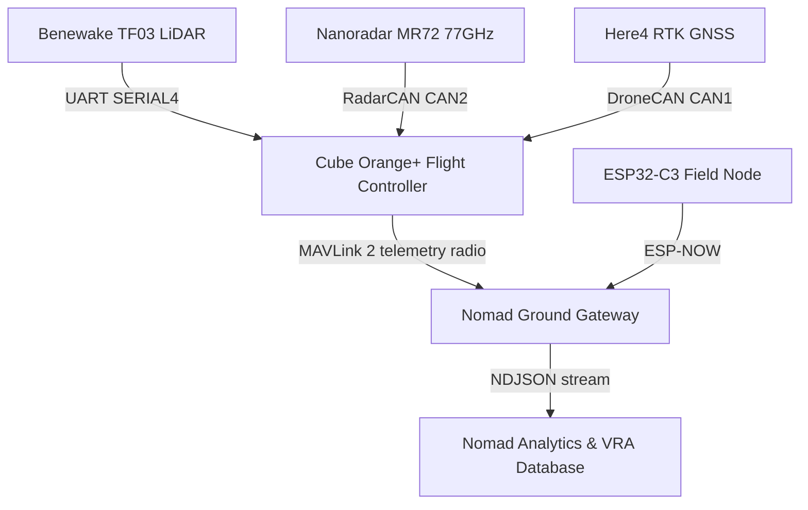
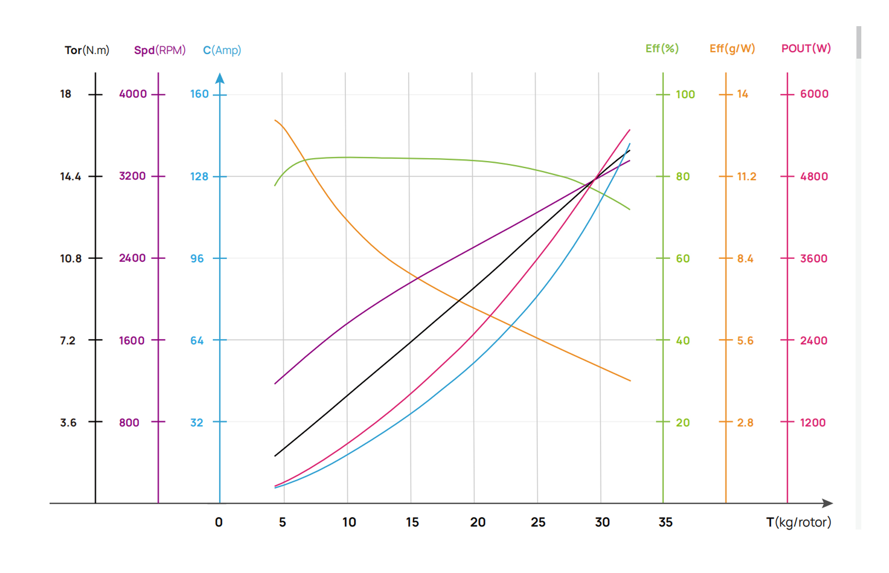
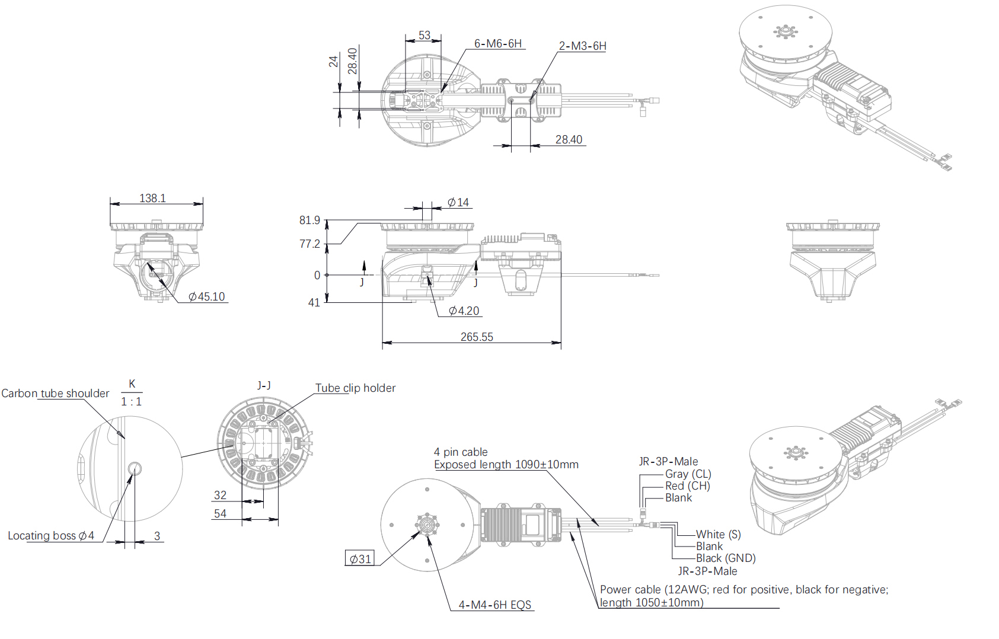
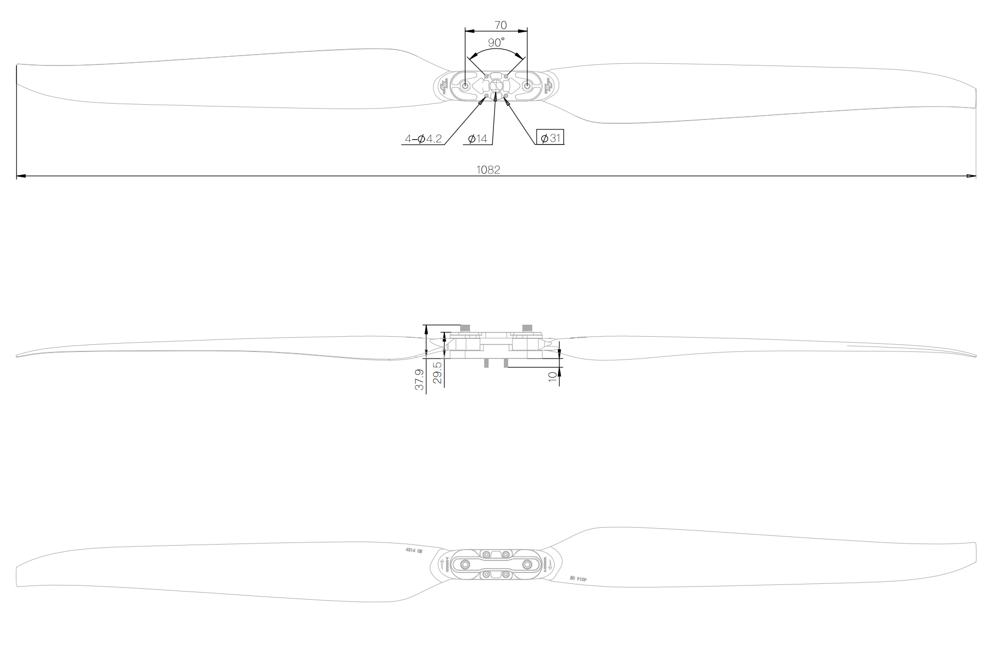
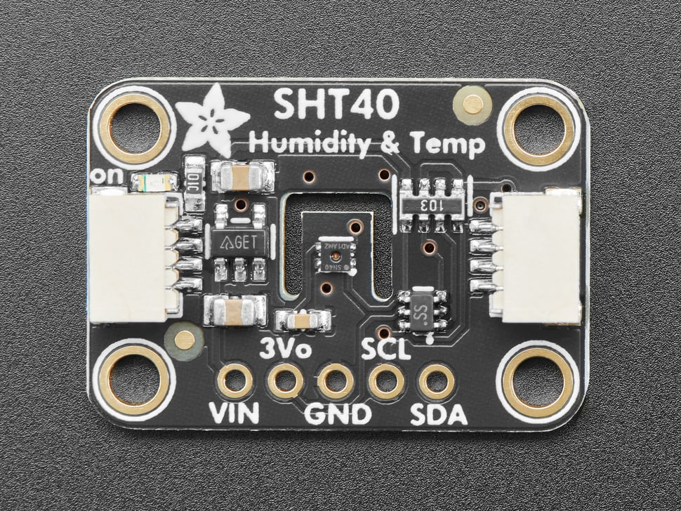

# Nomad Aerospace Flight Systems & Telemetry Repository

Core flight system configuration and telemetry software for **Nomad Aerospace** 
a Central Asian deep tech venture building heavy-lift agricultural UAVs.

> All technical values in this repository are governed by
> [`SPECS.md`](SPECS.md) the single source of truth for the platform.

---

## 🚀 System Overview

Nomad Aerospace is developing the **NOMAD K30**: a 30-liter, 60 kg-class
autonomous spraying UAV for precision agriculture across Central Asia,
built on an open ArduPilot avionics core with locally assembled hardware.

### Key Hardware & Avionics

* **Flight Controller:** Hex Cube Orange+ (triple IMU, vibration isolated) · ArduCopter 4.5.x
* **Propulsion:** 4× Hobbywing X11 G2 FOC integrated powertrains, 14S, 43×14 in props
* **Navigation:** CubePilot Here4 RTK GNSS (DroneCAN, centimetre class)
* **Terrain Altimetry:** Benewake TF03 long-range LiDAR (UART) canopy relative height hold
* **Obstacle Detection:** Nanoradar MR72 77 GHz forward-sector radar (dedicated CAN bus)
* **Field Edge Nodes:** ESP32-C3 (RISC-V) + Sensirion SHT4x, ESP-NOW uplink

---

## 🏗️ Hardware Ecosystem Architecture

---

## 📏 Hardware Blueprints & Airframe CAD

**Airframe Chassis: EFT K30 (30-Liter Payload Capacity)**
Motor to motor diagonal span: 1781 mm | Operational footprint: 1.3 × 1.3 m

## ⚡ Propulsion Performance

Hobbywing X11 G2 (14S) paired with 43×14 folding carbon propellers.

**Design hover point**  at 60 kg all-up weight (15 kg per axis), the
manufacturer thrust curve indicates roughly **1.9 kW and ~36 A per axis at
54 V nominal (~7.8 g/W)**, with substantial peak thrust margin remaining
for gust response and maneuvering. These figures are the design baseline
from the datasheet curve below; per airframe dynamometer validation is
part of the commissioning process.

**Integrated FOC Motor Mount & ESC Architecture**
45.1 mm carbon tube clamp, integrated FOC ESC cooling housing, 12 AWG power routing.

**43-Inch Propeller Geometry**
Blade length: 1082 mm | Pitch: 14 in | Dual-bolt carbon hub mount

---

## 📂 Repository Structure

* `/config` — Production ArduPilot parameter stack for the K30 airframe
* `/telemetry` — Ground gateway (Python) and field edge node firmware (C++)
* `SPECS.md` — Master platform specification (single source of truth)

---

## 🛠 Flight Safety Architecture

* **Battery failsafe ladder (14S):** arming refused below 3.6 V/cell; LOW
  (3.4 V/cell) triggers Return to Launch; CRITICAL (3.3 V/cell) triggers
  immediate controlled landing. Voltage is sag-compensated so full-tank
  spray-run current cannot cause false aborts.
* **Link-loss failsafes:** RC loss and ground-station loss both → RTL.
* **Geofence:** 30 m ceiling, 1 km radius hard envelope, breach → RTL.
* **Obstacle response:** forward radar STOPS the aircraft 3 m before an
  obstacle — the correct behaviour among poles, trees, and power lines.
* **Authority model:** all failsafe execution lives in the flight
  controller. Ground software observes and alerts; it never commands.

## 🌾 Precision Agriculture Functions

* **Terrain-following spray:** TF03 LiDAR holds constant nozzle height
  over uneven ground during autonomous missions.
* **Speed-proportional application:** pump flow scales with ground speed
  for uniform L/ha; spray auto-cuts below 1 m/s to prevent row-end pooling.
* **Field microclimate telemetry:** ESP32-C3 edge nodes wake every 5
  minutes, sample temperature/humidity, and push readings to the ground
  gateway over ESP-NOW for spray-window decision support.

### Edge Telemetry Node (`/telemetry`)

Ultra-low-power **ESP32-C3 (RISC-V)** nodes with **Sensirion SHT4x**
sensors. A conditional micro-heater routine detects condensation
(RH ≥ 95%), pulses the sensor heater, waits for thermal settling, and
re-samples preserving reading accuracy in morning dew conditions
instead of biasing it. Transport is ESP-NOW today; LoRaWAN is the
long-range upgrade path on the roadmap.

---

## 🗺 Roadmap (not yet implemented)

* 360° radar coverage (multi unit ring)
* LoRaWAN long range field mesh
* Encrypted telemetry transport
* SITL-validated autonomous mission library (`/missions`)

## 📄 License

See the [`LICENSE`](LICENSE) file. © 2026 Nomad Aerospace.
