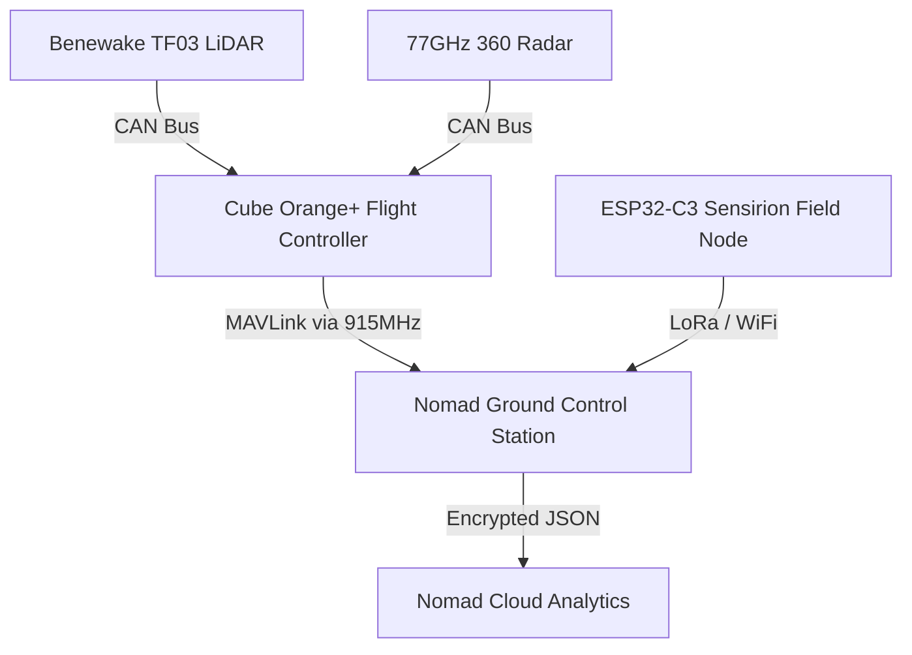

# Nomad Aerospace — Flight Systems & Telemetry Repository

Welcome to the official core flight system documentation and custom telemetry firmware for **Nomad Aerospace** — Central Asia's premier Deep Tech agricultural UAV platform.

---

## 🚀 System Overview

Nomad Aerospace engineers 30-liter / 60kg heavy-lift autonomous UAVs designed specifically for high-efficiency precision agriculture, crop dusting, and localized environmental telemetry across Central Asia.

### Key Hardware & Avionics Specifications
* **Flight Controller:** Hex Cube Orange+ (Triple-Redundant IMU, Vibration Isolated)
* **Firmware Base:** ArduPilot Copter (Custom Parameter Architecture)
* **Propulsion:** 4x Hobbywing X11 G2 FOC Integrated Motors (18S DC)
* **Primary Navigation:** Dual-Antenna Here4 RTK GNSS 
* **Sensor Fusion Safety Shield:**
  * **Altimetry:** Benewake TF03 Long-Range Industrial LiDAR (UART/CAN)
  * **Omnidirectional Shield:** 360° Millimeter-Wave Radar Ring (77GHz)
* **Field Edge-Nodes:** ESP32-C3 (RISC-V) with Sensirion SHT4x I2C Industrial Sensors

---

## 🏗️ Hardware Ecosystem Architecture

📂 Repository Structure
/config - Production ArduPilot parameter stacks for 30L heavy-lift airframes.
/telemetry - Ground gateway Python scripts and custom C++ edge-node firmware.
🛠 Advanced Features & Implementations
1. Sensor Fusion & Failsafe Protocols
GPS-Loss Failsafe: Automatic switch to AltHold with active LiDAR terrain-following and Radar boundary hold.
Smart Battery Failsafe: Dual-stage voltage monitoring on high-voltage 18S systems.
Variable Rate Application (VRA): Pump speed modulation tied directly to ground speed and microclimate data.
2. Edge Telemetry Node (/telemetry)
Custom C++ firmware developed for ultra-low-power ESP32-C3 RISC-V microcontrollers. Utilizing Sensirion SHT4x industrial I2C sensors with onboard micro-heaters, the node burns off morning dew to ensure 100% accurate field climate data. This guarantees spraying operations only occur during optimal agronomic windows.
📄 Intellectual Property
Copyright © 2026 Nomad Aerospace. All rights reserved. Hardware parameter profiles and custom telemetry firmware are licensed strictly for Nomad Aerospace deployment and partners.
